  

<!-- project overview -->

> *The Problem:* 
Traditional classrooms treat every student the same, but no two learners are alike. Students lose motivation because lessons feel generic, while instructors struggle to adapt materials for different learning styles.
>
> *The Solution:* 
Our platform transforms static lessons into *personalized learning experiences*. Instructors upload their curriculum, and AI instantly tailors examples, practice questions, and analogies to each student’s interests and hobbies without losing accuracy. Every student gets content that feels made just for them.

  

<!-- System Design -->

### ER Diagram

### SYSTEM Architecture

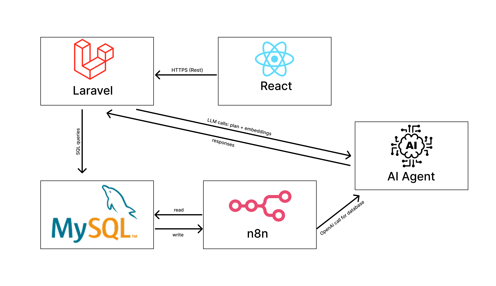
  

<!-- Project Highlights -->

### LearnVentures Sexy Features

- ✨ *AI-Personalized Lessons*
Students don’t just read, they connect. A football fan sees math problems framed as game stats, while a gamer sees them as power-ups. Same core concept, different engagement.

- 🤖 *A PrivateChat Section between the student and Optimus*
 A section for the student to chat privately with Optimus and ask them about definitions and clarifications. also it includes voice transcribtion where the student can record a voice and the voice will be transcribed to text message before the student can send it to optimus.

- 📈 *Quiz Performance Analysis*
The AI analyzes each quiz within the chapters to provide detailed performance insights. Students don’t just get scores. they receive a personalized performance analysis and a tailored study plan that highlights strengths, pinpoints weaknesses, and recommends next steps for improvement.

- 📝 *Daily Conversation Report Automation*
Instructors receive a daily report summarizing every conversation between students and the AI chatbot Optimus. Each report is automatically generated every 24 hours, providing a clear record of student–AI interactions. This keeps instructors informed, ensures transparency in learning progress, and helps maintain accountability in how students engage with the AI.

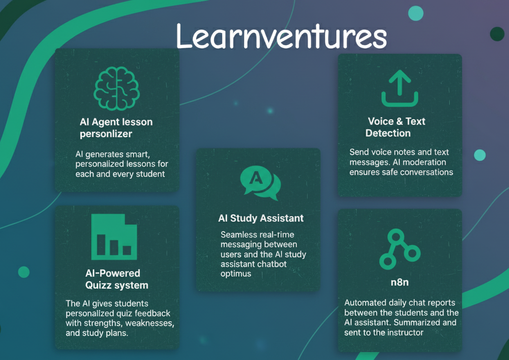

  

<!-- Demo -->

### User Screens (Web)

| Landing Page 1                     | Login                             | Register                        |
| ---------------------------------- | --------------------------------- | -------------------------------- |
|  |  |  |

| Landing page 2                            | User Dashboard                       |Student Profile                      |
| --------------------------------------- | ------------------------------------- | ------------------------------------- |
|  |  |  |

| Optimus studying Assistant                           | Personilized Lesssons                       |Quizz System                      |
| --------------------------------------- | ------------------------------------- | ------------------------------------- |
|  |  |  |

### Admin Screens (Web)

| Content managment                             | Chat daily Report                       |
| --------------------------------------- | ------------------------------------- |
| 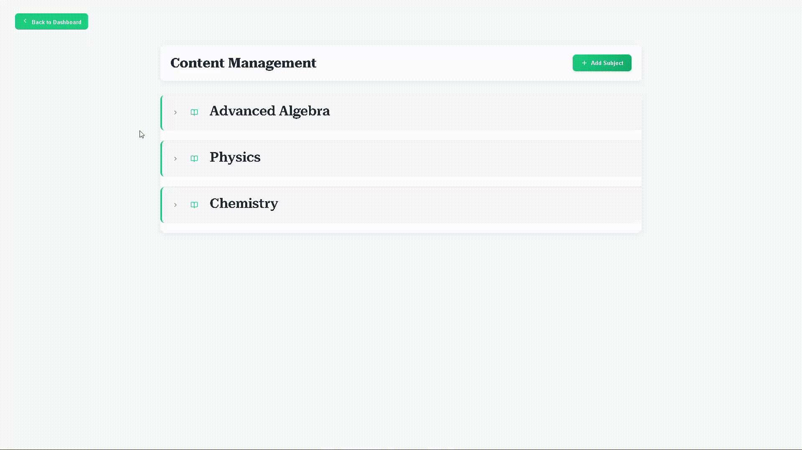 |  |

### Automation Workflow

| n8n workflow                             | 
| --------------------------------------- | 
|  | 

  

<!-- Development & Testing -->

### CI Workflow

| CI 1                             | CI 2                       |
| --------------------------------------- | ------------------------------------- |
| 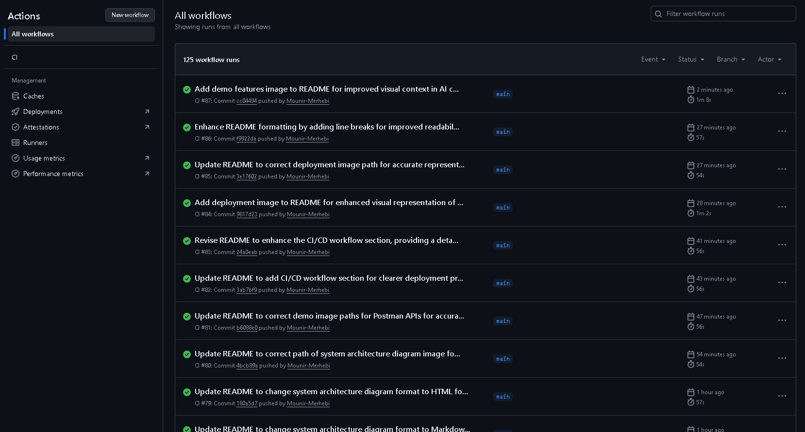 | 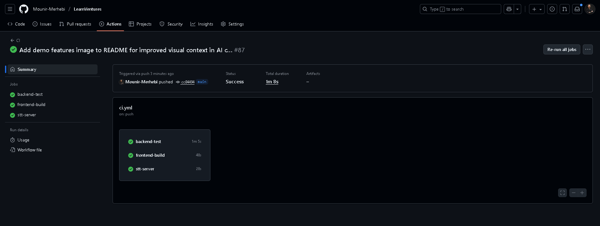 |

### Services, Validation and Testing

| Services                            | Validation                       | Testing                        |
| --------------------------------------- | ------------------------------------- | ------------------------------------- |
| 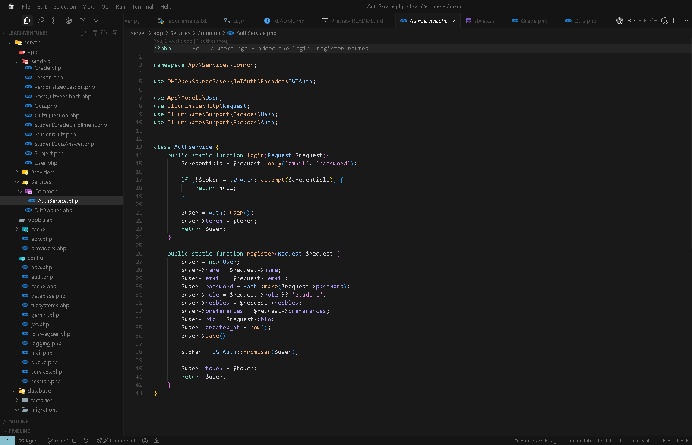 | 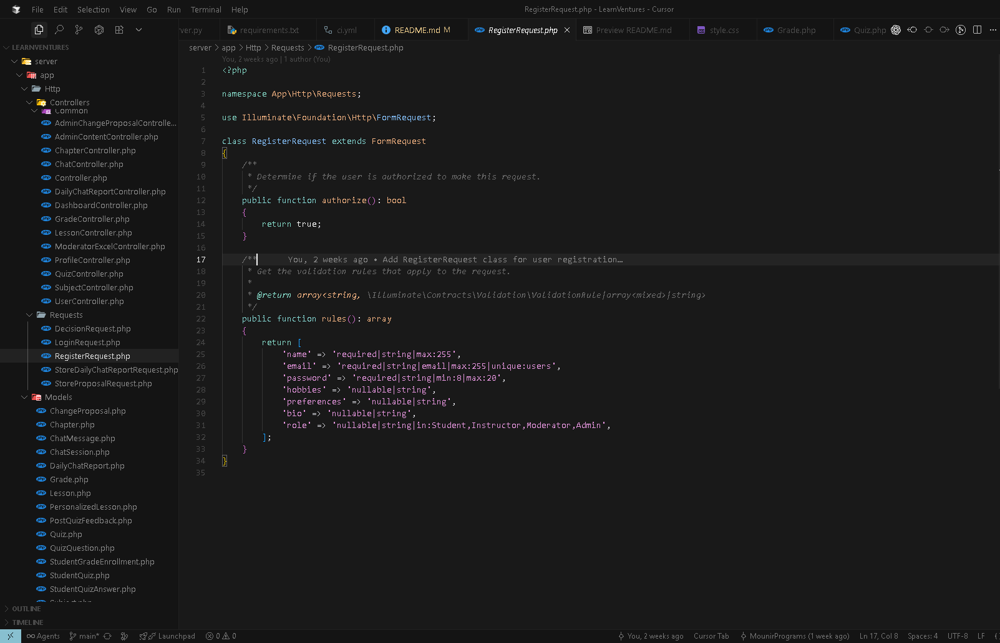 | 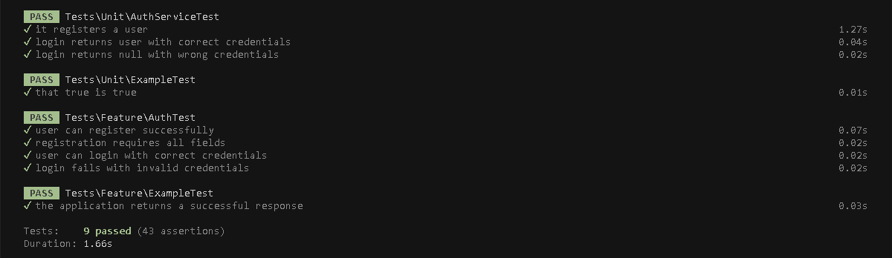 |

  

<!-- Deployment -->

### Development → Deployment Flow

1. **Feature Development**
   - Work begins on a new feature inside a local branch.
   - The branch is pushed to its remote equivalent on GitHub.

2. **Integration to Staging**
   - The remote feature branch is merged into the staging branch.
   - This triggers GitHub Actions.

3. **CI on Staging**
   - GitHub Actions provisions a temporary database.
   - Migrations run, automated tests execute, and the app is booted in a test environment.
   - If all checks pass, the pipeline continues.

4. **Staging Deployment**
   - GitHub Actions pushes code to the staging EC2 instance.
   - A deployment script builds Docker containers:
     - Laravel backend
     - Node services
     - Database
     - React frontend
   - Containers spin up, serving the staging environment.

5. **Production Release**
   - Once the feature is approved, staging is merged into the main branch.
   - GitHub Actions reruns the same pipeline steps, but deployment is directed to the production EC2 instance.

 

   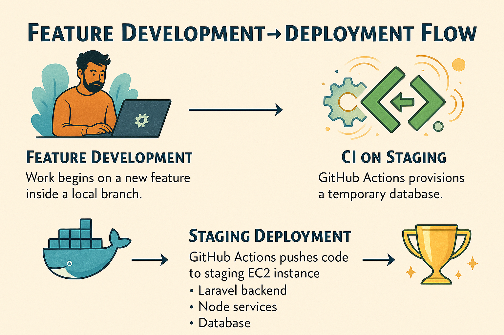

  

###  Linear Workflow

Below is a screenshot of our Linear board, which we used to manage tasks throughout development:

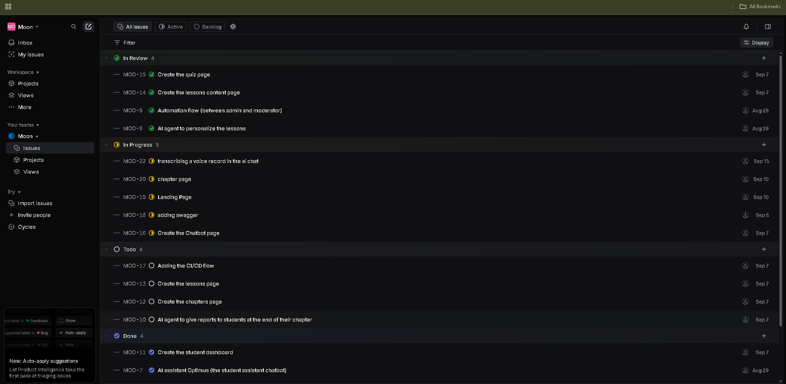

**Workflow steps:**
- Create ticket in Linear  
- Make a branch following Linear naming standards  
- Commit changes with task IDs mentioned in commit messages  
- Push branch to remote  
- Open a pull request  
- Merge pull request once approved  

---

## Eraser Diagrams
We used [Eraser](https://app.eraser.io/) to design and maintain our architecture and database diagrams.  
Eraser was chosen because:
- **Diagram-as-code**: diagrams are represented in a simple code-like format, making them version-controllable.  
- **Ease of use**: allows quick edits and sharing without heavy tools.  
- **Collaboration**: teammates can easily view or update diagrams.  

[Eraser Public Board Link](https://app.eraser.io/workspace/3zg4gXt67Cxc4bqKBnSu)

| Swagger API 1                            | Swagger API 2                       | Swagger API 3                        |
| --------------------------------------- | ------------------------------------- | ------------------------------------- |
| 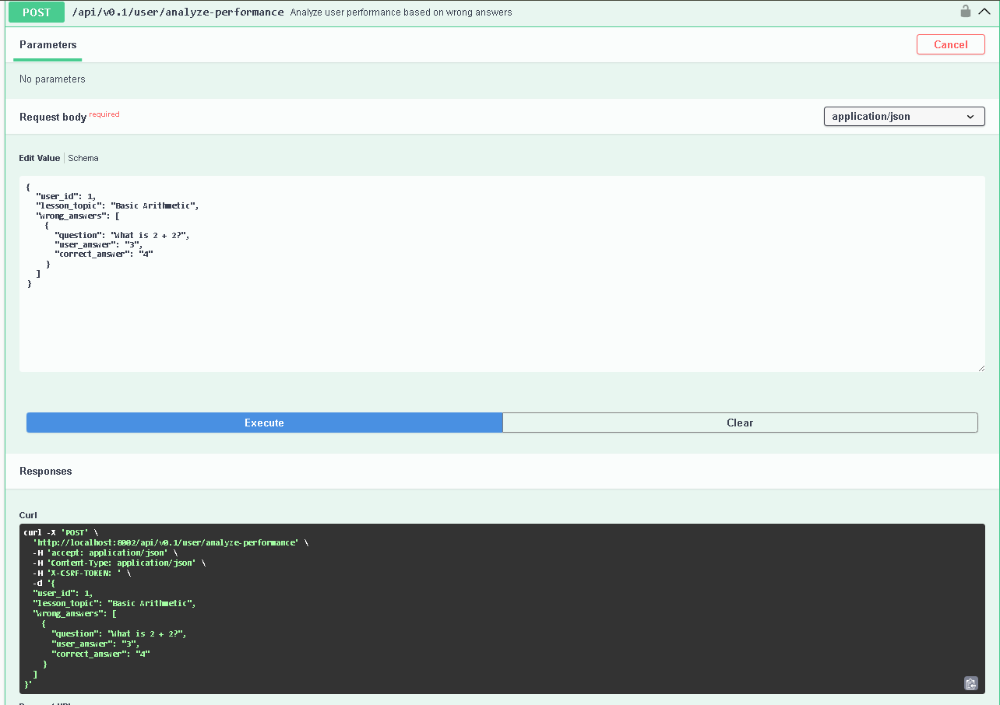 | 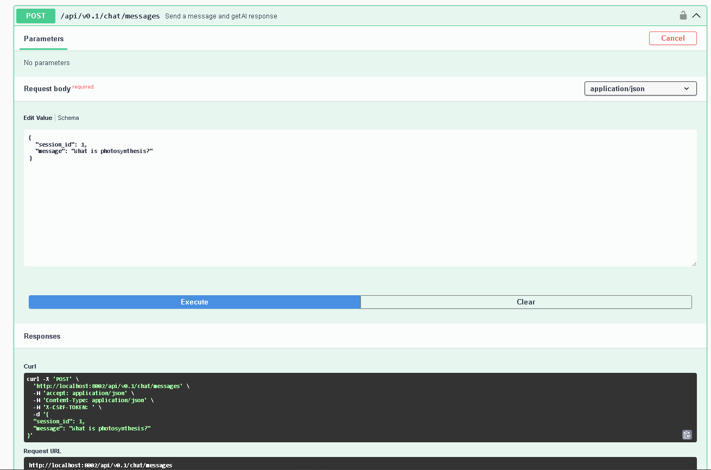 | 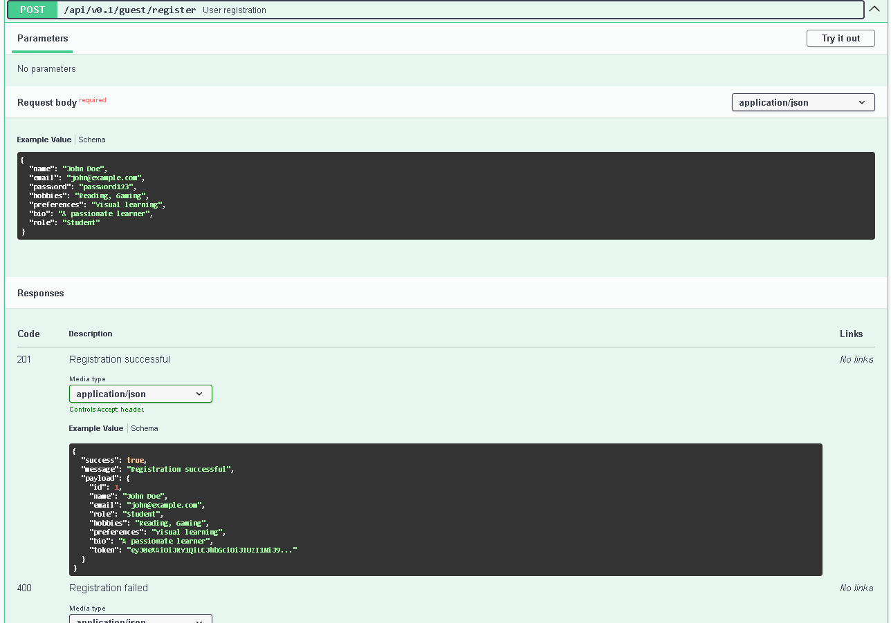 |

  