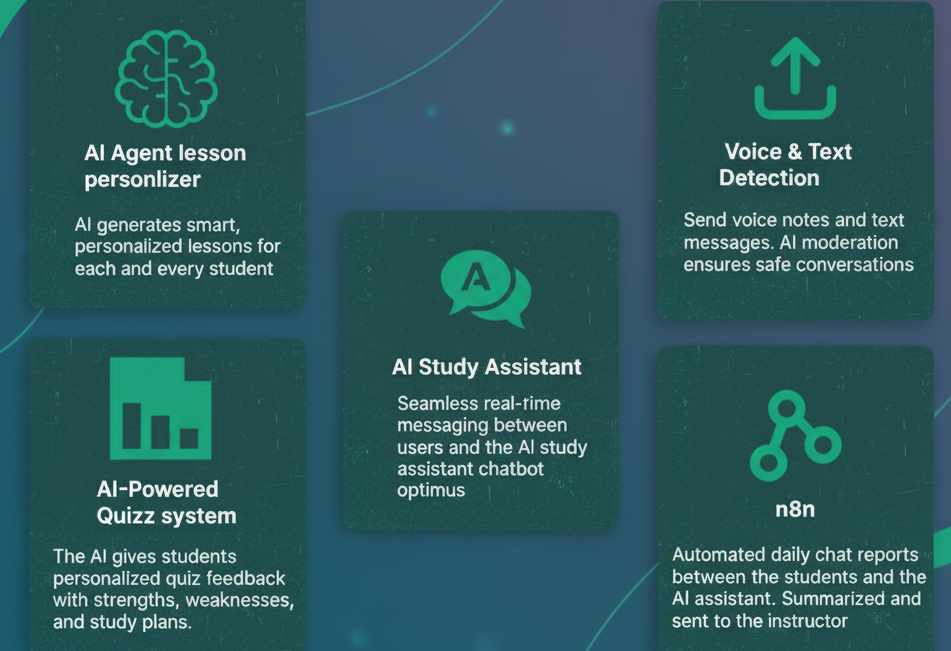

  

<!-- project overview -->

> *The Problem:* 
Traditional classrooms treat every student the same, but no two learners are alike. Students lose motivation because lessons feel generic, while instructors struggle to adapt materials for different learning styles.
>
> *The Solution:* 
Our platform transforms static lessons into *personalized learning experiences*. Instructors upload their curriculum, and AI instantly tailors examples, practice questions, and analogies to each student’s interests and hobbies without losing accuracy. Every student gets content that feels made just for them.

  

<!-- System Design -->

### ER Diagram

### System Architecture

### Automation Workflow

| n8n workflow                             | 
| --------------------------------------- | 
|  | 

  

<!-- Project Highlights -->

## LearnVentures Sexy Features

## Upcoming Features

**Parent Portal**  
Introduce a dedicated parent user type where parents can view their children’s grades, track performance, and communicate directly with instructors through a chat page.  

**Grade Group Chat**  
Create a group chat space for each grade, allowing students to collaborate, share ideas, and build community, all under the supervision of their instructor.  

**Agenda & Homework Tracker**  
Provide students with a daily agenda showing tasks and homework to complete. This will be linked with Google Calendar, sending automated reminders to help students stay on track.  

  

<!-- Demo -->

### User Screens (Web)

| Landing Page 1                     | Landing Page 2                    |
| ---------------------------------- | --------------------------------- |
|  |  |

| Login                              | Register                          |
| ---------------------------------- | --------------------------------- |
|   |  |

| User Dashboard                     | Student Profile                   |
| ---------------------------------- | --------------------------------- |
|  |  |

| Optimus Studying Assistant         | Personalized Lessons              |
| ---------------------------------- | --------------------------------- |
|  |  |

| Quiz System                        |                                   |
| ---------------------------------- | --------------------------------- |
|    |                                   |

### Admin Screens (Web)

| Content managment                             | Chat daily Report                       |
| --------------------------------------- | ------------------------------------- |
|  |  |

  

<!-- Development & Testing -->

###  Linear Workflow

Below is a screenshot of our Linear board, which we used to manage tasks throughout development:

**Workflow steps:**
- Create ticket in Linear  
- Make a branch following Linear naming standards  
- Commit changes with task IDs mentioned in commit messages  
- Push branch to remote  
- Open a pull request  
- Merge pull request once approved  

---

## Eraser Diagrams
We used [Eraser](https://app.eraser.io/) to design and maintain our architecture and database diagrams.  
Eraser was chosen because:
- **Diagram-as-code**: diagrams are represented in a simple code-like format, making them version-controllable.  
- **Ease of use**: allows quick edits and sharing without heavy tools.  
- **Collaboration**: teammates can easily view or update diagrams.  

[Eraser Public Board Link](https://app.eraser.io/workspace/3zg4gXt67Cxc4bqKBnSu)

### Services, Validation and Testing

| Services                            | Validation                       | Testing                        |
| --------------------------------------- | ------------------------------------- | ------------------------------------- |
|  |  |  |

# AI Agents

## Lessons Personalization AI Agent
- **What it uses:** Student’s interests, hobbies, and preferences, plus lessons prepared by the instructor.  
- **What it does:** Looks at the student’s profile and adapts the lessons to match their style and interests.  
- **What comes out:** Each student gets a personalized version of the lesson made just for them.  

## Quiz Performance Analysis AI Agent
- **What it uses:** The student’s quiz answers and the correct answers.  
- **What it does:** After a quiz is finished, it reviews the student’s mistakes, explains weak points, and prepares a study plan.  
- **What comes out:** A clear report with performance insights and advice on how to improve.  

## AI Study Assistant
- **What it uses:** All the lessons for the student’s grade.  
- **What it does:** Acts like a smart helper that answers the student’s questions using the lesson material.  
- **What comes out:** Helpful, easy-to-understand answers to support the student’s learning.  

## Daily Chat Reports AI Agent
- **What it uses:** The daily chat conversations between each student and the AI assistant Optimus.  
- **What it does:** Every 24 hours, it reviews the chats, summarizes them, and prepares a report.  
- **What comes out:** Instructors receive a daily report for each student showing their progress and activity.  

  

<!-- Deployment -->

### Development → Deployment Flow

1. **Feature Development**
   - Work begins on a new feature inside a local branch.
   - The branch is pushed to its remote equivalent on GitHub.

2. **Integration to Staging**
   - The remote feature branch is merged into the staging branch.
   - This triggers GitHub Actions.

3. **CI on Staging**
   - GitHub Actions provisions a temporary database.
   - Migrations run, automated tests execute, and the app is booted in a test environment.
   - If all checks pass, the pipeline continues.

4. **Staging Deployment**
   - GitHub Actions pushes code to the staging EC2 instance.
   - A deployment script builds Docker containers:
     - Laravel backend
     - Node services
     - Database
     - React frontend
   - Containers spin up, serving the staging environment.

5. **Production Release**
   - Once the feature is approved, staging is merged into the main branch.
   - GitHub Actions reruns the same pipeline steps, but deployment is directed to the production EC2 instance.

 

   

 

## Swagger Documentation
Swagger is included for API exploration and testing.

### Usage

* **Interactive API testing**: Send test requests directly from Swagger UI without needing Postman or curl.
* **Endpoint reference**: View all available API endpoints, grouped by controller/module.
* **Request/Response details**: See the required parameters, request body examples, and the expected response schema.
* **Authentication support**: If your API uses tokens or authentication headers, you can enter them once and test secured endpoints.

| Swagger API 1                            | Swagger API 2                       | Swagger API 3                        |
| --------------------------------------- | ------------------------------------- | ------------------------------------- |
|  |  |  |

  