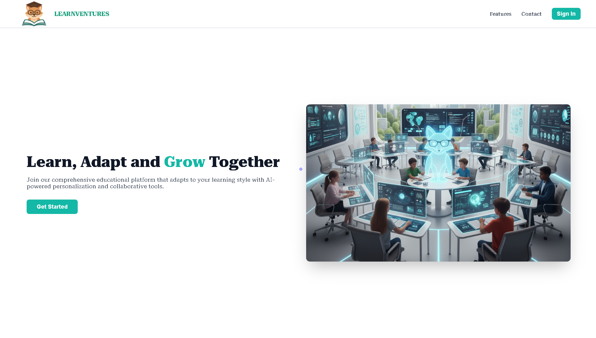

  

<!-- project overview -->

> *The Problem:* 
Traditional classrooms treat every student the same, but no two learners are alike. Students lose motivation because lessons feel generic, while instructors struggle to adapt materials for different learning styles.
>
> *The Solution:* 
Our platform transforms static lessons into *personalized learning experiences*. Instructors upload their curriculum, and AI instantly tailors examples, practice questions, and analogies to each student’s interests and hobbies without losing accuracy. Every student gets content that feels made just for them.

  

<!-- System Design -->

### ER Diagram

### SYSTEM Architecture

- To be decided on later on.
  

<!-- Project Highlights -->

### LearnVentures Sexy Features

- ✨ *AI-Personalized Lessons*
Students don’t just read, they connect. A football fan sees math problems framed as game stats, while a gamer sees them as power-ups. Same core concept, different engagement.

- 🤖 *A PrivateChat Section between the student and Optimus*
 A section for the student to chat privately with Optimus and ask them about definitions and clarifications. also it includes voice transcribtion where the student can record a voice and the voice will be transcribed to text message before the student can send it to optimus.

- 📈 *Quiz Performance Analysis*
The AI analyzes each quiz within the chapters to provide detailed performance insights. Students don’t just get scores. they receive a personalized performance analysis and a tailored study plan that highlights strengths, pinpoints weaknesses, and recommends next steps for improvement.

- 📝 *Daily Conversation Report Automation*
Instructors receive a daily report summarizing every conversation between students and the AI chatbot Optimus. Each report is automatically generated every 24 hours, providing a clear record of student–AI interactions. This keeps instructors informed, ensures transparency in learning progress, and helps maintain accountability in how students engage with the AI.

  

<!-- Demo -->

### User Screens (Mobile)

| Login                             | Register                        |Landing Page 1                     |
| --------------------------------------- | ------------------------------------- | ------------------------------------- |
|  |  |  |

| Landing page 2                            | User Dashboard                       |Student Profile                      |
| --------------------------------------- | ------------------------------------- | ------------------------------------- |
|  |  |  |

| Optimus studying Assistant                           | Personilized Lesssons                       |Quizz System                      |
| --------------------------------------- | ------------------------------------- | ------------------------------------- |
|  |  |  |

### Admin Screens (Web)

| Content managment                             | Chat daily Report                       |
| --------------------------------------- | ------------------------------------- |
|  |  |

### Automation Workflow

| n8n workflow                             | 
| --------------------------------------- | 
|  | 

  

<!-- Development & Testing -->

### Add Title Here

| Services                            | Validation                       | Testing                        |
| --------------------------------------- | ------------------------------------- | ------------------------------------- |
|  |  |  |

  

<!-- Deployment -->

### Add Title Here

- Description here.

| Postman API 1                            | Postman API 2                       | Postman API 3                        |
| --------------------------------------- | ------------------------------------- | ------------------------------------- |
|  |  |  |

  